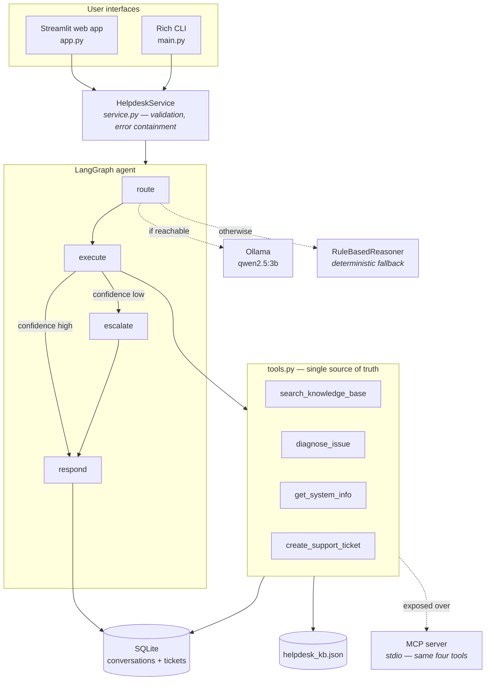

# AI IT Helpdesk

[](https://github.com/YOUR_USERNAME/ai-it-helpdesk/actions/workflows/ci.yml)
[](https://www.python.org/)
[](LICENSE)
[](tests/)
[](https://docs.astral.sh/ruff/)

> An agentic IT support desk that runs entirely on your own machine.
> No API keys, no cloud, no cost.

---

## 1. Project overview

An internal IT helpdesk application. A user describes a problem in plain
English; a **LangGraph** agent decides which tool to run, executes it through
tools also exposed over the **Model Context Protocol**, and — the part that
makes it an agent rather than a pipeline — **checks its own confidence before
answering**. When retrieval is weak it raises a support ticket instead of
inventing a fix.

There are two front ends over the same engine:

- a **Streamlit web app** for demonstrating and using it
- a **Rich CLI** for scripted runs and diagnostics

Reasoning runs on a local **Ollama** model. Everything is persisted to local
**SQLite**. Nothing ever leaves the machine.

---

## 2. Problem statement

Campus and office IT desks are flooded with the same handful of issues — Wi-Fi,
printers, VPN, passwords, slow machines. Two common approaches both fail:

| Approach | Failure mode |
|---|---|
| Rule-based chatbot | Cannot interpret free-form descriptions; breaks on any phrasing it wasn't scripted for |
| LLM chatbot over a knowledge base | Answers confidently even when it has retrieved nothing relevant |

The second failure is the expensive one. A user follows five useless steps,
loses twenty minutes, and files a ticket anyway — now with less trust in the
system.

This project targets that specific gap: an agent that **knows when it does not
know**, and escalates instead of guessing.

---

## 3. Architecture diagram



---

## 4. Tech stack

| Layer | Technology | Why |
|---|---|---|
| Agent orchestration | LangGraph | State machine with a real conditional branch |
| LLM | Ollama + `qwen2.5:3b` | Local, free, runs on a laptop CPU |
| LLM bindings | LangChain (`langchain-ollama`, `langchain-core`) | Standard message interface |
| Tool protocol | MCP Python SDK | Tools usable by any MCP client |
| Web UI | Streamlit | Pure Python, no JS build step |
| Tables | pandas | Ticket and history grids |
| CLI | Rich | Readable terminal output |
| Storage | SQLite (stdlib) | Zero-setup local persistence |
| Config | python-dotenv | Nothing hard-coded |
| Tests / lint | pytest, Streamlit AppTest, ruff | 115 tests, CI on 3 Python versions |

No paid service appears anywhere in the dependency list.

---

## 5. Features

**Agent**
- Tool routing by a local LLM, with keyword fallback
- Calibrated retrieval confidence on every answer
- Automatic escalation to a human ticket below threshold
- Graceful degradation when Ollama is absent

**Web UI** — six pages
- **Helpdesk** — chat interface, clickable example problems, escalation banner with the ticket ID, optional per-answer agent details
- **Tickets** — filter by status, read the full description, move tickets through open → in progress → resolved → closed
- **History** — every recorded turn with the tool used, confidence and escalation flag; drill into any single turn
- **Knowledge base** — browse all 16 articles by category or free-text search
- **Dashboard** — live counters, reasoning mode, configured model, escalation threshold
- **Diagnostics** — the same checks as `doctor`, plus an on-demand MCP handshake

**CLI** — `chat`, `ask`, `demo`, `tickets`, `history`, `doctor`, `mcp-check`

---

## 6. LangGraph workflow

```
route ──▶ execute ──┬── confidence >= threshold ──▶ respond ──▶ END
                    └── confidence <  threshold ──▶ escalate ──┘
```

| Node | Responsibility |
|---|---|
| `route` | The reasoner picks one of the four tools and records why |
| `execute` | Runs it; returns text, a confidence score and metadata |
| *(conditional edge)* | `_should_escalate` inspects the result |
| `escalate` | Creates a ticket and folds it into the response context |
| `respond` | Writes the user-facing answer |

**Why a graph rather than three function calls?** A straight chain would not
need a framework. The conditional edge out of `execute` is what earns it: the
agent inspects its own output and changes its plan. That is the difference
between automation and agency.

State flows as a `TypedDict`; every node returns a partial update rather than
mutating shared state.

---

## 7. MCP architecture

All four tools are exposed over the Model Context Protocol via stdio:

```
src/helpdesk/tools.py       <- the implementations
        |
        +-- graph.py        <- in-process calls (fast path used by both UIs)
        +-- mcp_server.py   <- MCP wrappers returning plain strings
                    ^
                    | stdio / JSON-RPC
            mcp_client.py   <- used by `mcp-check` and the Diagnostics page
```

Three details worth knowing:

- **One definition, two surfaces.** Both import from `tools.py`, so a tool
  cannot behave differently depending on how it was reached.
- **Version shim.** The SDK renamed `FastMCP` to `MCPServer` in mcp 2.0;
  `mcp_server.py` imports whichever exists, so the project installs on either.
- **stdout is the protocol channel.** Status messages go to stderr; a stray
  `print()` would corrupt the JSON-RPC stream.

Because the tools are real MCP tools, any MCP client can drive them:

```json
{
  "mcpServers": {
    "ai-it-helpdesk": {
      "command": "python",
      "args": ["-m", "helpdesk.mcp_server"],
      "cwd": "C:\\path\\to\\ai-it-helpdesk",
      "env": { "PYTHONPATH": "C:\\path\\to\\ai-it-helpdesk\\src" }
    }
  }
}
```

---

## 8. Knowledge-base retrieval and the confidence mechanism

Each article is scored against the query on four weighted signals, producing a
value in `[0, 1]`:

| Signal | Weight | Meaning |
|---|---|---|
| Coverage | 0.45 | Fraction of the query's meaningful words the article explains |
| Title | 0.20 | Overlap with the article title |
| Category | 0.20 | The query names a category — "vpn", "printer" |
| Symptom | 0.15 | Overlap with the curated symptom phrases |

Preprocessing lowercases, strips inner hyphens so `Wi-Fi` survives as one token,
splits on non-alphanumerics, and drops stopwords and very short tokens.

Two rules keep results honest:

- **Weak matches are dropped** — anything below half the top score is discarded,
  so a strong answer is never padded with filler.
- **A miss returns nothing** — an empty list, not the closest article. That
  emptiness is what drives escalation.

**Why keyword scoring rather than embeddings?** Embeddings handle paraphrase
better, but add a model download, a vector index and a second inference step —
and the score becomes a cosine distance nobody can explain. Since this score
decides whether a human gets pulled in, being able to justify it line by line is
worth more than the recall gain. The trade-off is listed under Limitations
rather than hidden.

---

## 9. Escalation logic

```python
def needs_escalation(result: ToolResult) -> bool:
    return result.ok is False or result.confidence < settings.escalation_threshold
```

The threshold defaults to `0.35` and is configurable via `.env`.

- If the router already chose `create_support_ticket`, the graph does **not**
  escalate again — no double ticketing.
- A tool that fails returns `ok=False`, which also escalates. A broken tool
  becomes a ticket, never a crash.
- Escalation folds the ticket into the response context, so the answer the user
  reads names the ticket ID directly.

In the web UI an escalated answer renders with an amber banner and the ticket ID
in monospace, so a demo viewer cannot miss it.

---

## 10. SQLite persistence

Two tables in `data/helpdesk.db`:

| Table | Columns |
|---|---|
| `conversations` | query, route reason, tool, tool result, final response, confidence, escalated, llm_mode, created_at |
| `support_tickets` | ticket_id, query, description, status, created_at |

- Connections are context-managed: commit on success, rollback on exception,
  always close.
- Timestamps are timezone-aware UTC (`datetime.utcnow()` is deprecated in 3.12
  and returns a naive value that compares incorrectly).
- Ticket IDs are `TKT-<UTC timestamp>-<4 random hex>`. A test creates 50 tickets
  inside one second to prove they do not collide.

The web UI and the CLI read and write the same tables — `python main.py tickets`
shows exactly what the Tickets page shows.

---

## 11. Local Ollama setup

```powershell
# 1. Install Ollama from https://ollama.com
# 2. Pull the model (about 2 GB)
ollama pull qwen2.5:3b
# 3. Leave Ollama running, then confirm the app can see it
python main.py doctor
```

Configuration comes from `.env` (copy `.env.example`):

| Variable | Default |
|---|---|
| `OLLAMA_MODEL` | `qwen2.5:3b` |
| `OLLAMA_BASE_URL` | `http://localhost:11434` |
| `LLM_TEMPERATURE` | `0.1` |
| `LLM_MAX_TOKENS` | `512` |
| `KB_TOP_K` | `3` |
| `ESCALATION_THRESHOLD` | `0.35` |
| `HELPDESK_OFFLINE` | `0` |

Any model Ollama can serve will work — set `OLLAMA_MODEL` and restart.

---

## 12. Offline fallback

**The application works with no LLM installed.** If Ollama is unreachable, a
`RuleBasedReasoner` takes over: keyword routing and template wording.

Everything else is unchanged — retrieval, confidence scoring, the escalation
branch, ticketing, persistence and MCP all behave identically.

The app never pretends a model was used:

- the sidebar shows an amber **Offline fallback mode** pill
- the Helpdesk page shows a banner explaining what is degraded
- Diagnostics marks it as a warning
- every stored turn records its `llm_mode`

Force it deliberately with the sidebar toggle, `--offline` on the CLI, or
`HELPDESK_OFFLINE=1`. This is how the test suite and CI run.

---

## 13. Installation (Windows / PowerShell)

Requires **Python 3.10+**.

```powershell
git clone https://github.com/YOUR_USERNAME/ai-it-helpdesk.git
cd ai-it-helpdesk

python -m venv .venv
.\.venv\Scripts\Activate.ps1

python -m pip install --upgrade pip
pip install -r requirements.txt
```

If PowerShell blocks the activation script:

```powershell
Set-ExecutionPolicy -Scope Process -ExecutionPolicy RemoteSigned
.\.venv\Scripts\Activate.ps1
```

Optional — installs the `helpdesk` command and the dev tools:

```powershell
pip install -r requirements-dev.txt
pip install -e .
```

Ollama is optional. Without it the app runs in offline fallback mode.

---

## 14. Running the CLI

```powershell
python main.py                                   # interactive chat
python main.py ask "my wifi keeps dropping" -v   # single question, with trace
python main.py demo                              # scripted four-problem walkthrough
python main.py tickets --status open             # ticket list
python main.py history                           # recent turns
python main.py doctor                            # environment check
python main.py mcp-check                         # live MCP handshake
```

Add `--offline` to `chat`, `ask` or `demo` to skip Ollama.
After `pip install -e .` the same commands are available as `helpdesk ...`.

---

## 15. Running the web UI

```powershell
streamlit run app.py
```

Opens on <http://localhost:8501>. To pick a port:

```powershell
streamlit run app.py --server.port 8502
```

For a guaranteed-fast demo with no model dependency:

```powershell
$env:HELPDESK_OFFLINE = "1"
streamlit run app.py
```

(or just flip **Force offline mode** in the sidebar).

---

## 16. Running the tests

```powershell
pip install -r requirements-dev.txt

$env:HELPDESK_OFFLINE = "1"
pytest

ruff check src tests main.py app.py
```

115 tests across seven files:

| File | Count | Focus |
|---|---|---|
| `test_knowledge_base.py` | 16 | Ranking, weak-match filtering, empty results on a miss |
| `test_graph.py` | 13 | Both branches of the conditional edge, no double ticketing |
| `test_database.py` | 11 | Round-trips, ID collisions, rollback, tz-aware timestamps |
| `test_tools.py` | 11 | Tool contracts, dispatch, failure handling |
| `test_mcp_server.py` | 4 | The MCP surface matches the tool registry |
| `test_service.py` | 33 | Validation, escalation, tickets, history, dashboard, health |
| `test_web.py` | 27 | Real Streamlit renders via `AppTest` — every page, the full chat flow |

No test needs Ollama, so CI runs the whole suite on Python 3.10, 3.11 and 3.12.

---

## 17. MCP verification

```powershell
python main.py mcp-check
```

This spawns `helpdesk.mcp_server` as a subprocess, completes the stdio
handshake, lists the advertised tools and invokes one, printing the result. The
Diagnostics page has a **Run MCP handshake** button that does the same thing.

"This project uses MCP" is a claim; these are the evidence.

---

## 18. Placement demo (3 minutes)

Set up beforehand: venv activated, `streamlit run app.py` running, browser open,
**Force offline mode** ON for speed and reproducibility.

| # | Action | What to say |
|---|---|---|
| 1 | Show the sidebar mode pill | "Runs fully locally — no API keys. Right now on the deterministic fallback; with Ollama running it uses a local 3B model." |
| 2 | Click **Printer is offline** | "Plain English in, no menus." |
| 3 | Expand **Agent details** | "The agent chose the knowledge-base tool, matched at 95%, did not escalate. That's the graph's actual execution record." |
| 4 | Click the **quantum flux capacitor** example | "Now something it has never seen." |
| 5 | Point at the amber banner | "Confidence was 0%. Rather than invent an answer, it escalated and raised a ticket — here's the ID." |
| 6 | Open **Tickets** | "Persisted to SQLite. I can move it through the workflow." Change status to *In progress*. |
| 7 | Open **History** | "Every turn is recorded with the tool used, the confidence and whether it escalated." |
| 8 | Open **Dashboard** | "Counters, model in use, and the escalation threshold." |
| 9 | Open **Diagnostics** → **Run MCP handshake** | "The tools are also real MCP tools — this spawns the server and lists them live." |

If you have four minutes, add a terminal: `python main.py history` shows the same
rows, proving both front ends share one engine.

---

## 19. Screenshots

> Captures go in [`docs/screenshots/`](docs/screenshots/) — see the README there
> for the recommended shot list. Replace the placeholders below once taken.

| Screen | Image |
|---|---|
| Helpdesk chat | `docs/screenshots/helpdesk.png` |
| Escalation with ticket ID | `docs/screenshots/escalation.png` |
| Ticket management | `docs/screenshots/tickets.png` |
| Dashboard | `docs/screenshots/dashboard.png` |
| Diagnostics | `docs/screenshots/diagnostics.png` |

---

## 20. Limitations

Stated plainly, because being able to name these is worth more in an interview
than pretending they don't exist:

- **Keyword retrieval misses paraphrase.** "My machine won't get online" shares
  no vocabulary with "Wi-Fi not connecting" and will escalate. Embeddings would
  fix it at the cost of a heavier dependency.
- **The knowledge base holds 16 articles.** Anything outside them escalates by
  design, which is correct but limits the useful range.
- **No multi-turn memory.** History is stored but not fed back into the prompt,
  so follow-ups like "that didn't work" start fresh.
- **Single user, no auth.** Local-only; not hardened for shared deployment.
- **Small-model routing is imperfect.** `qwen2.5:3b` occasionally returns
  malformed JSON; parsing is defensive and falls back to keyword routing, but
  a larger model would route better.
- **Streamlit reruns the whole script** on each interaction. Fine at this scale,
  but it is not a production web architecture.
- **Confidence is a retrieval score, not a calibrated probability.** It reflects
  keyword overlap, not a guarantee the answer is correct.

---

## 21. Future enhancements

- Swap keyword scoring for a local sentence-transformer, keeping the same
  confidence interface so the escalation logic is untouched
- Feed the last N turns into the router for follow-up questions
- Ticket assignment, SLA timers and a resolution-notes field
- Let an admin add knowledge-base articles from the UI
- Expose the agent over FastAPI so other internal tools can call it
- Optional MCP transport toggle so the UI can route through stdio for a demo

---

## 22. License

MIT — see [LICENSE](LICENSE).

---

## Project layout

```
ai-it-helpdesk/
├── app.py                      # web entry point  -> streamlit run app.py
├── main.py                     # CLI entry point  -> python main.py
├── src/
│   ├── helpdesk/               # the engine
│   │   ├── service.py          # UI-facing facade: validation, error containment
│   │   ├── graph.py            # LangGraph state machine
│   │   ├── tools.py            # the four tools, single source of truth
│   │   ├── llm.py              # Ollama reasoner + rule-based fallback
│   │   ├── knowledge_base.py   # scored retrieval
│   │   ├── database.py         # SQLite
│   │   ├── mcp_server.py       # MCP over stdio
│   │   ├── mcp_client.py       # MCP client for verification
│   │   ├── cli.py              # Rich terminal UI
│   │   └── config.py           # .env-backed settings
│   └── web/                    # Streamlit front end (presentation only)
│       ├── runner.py           # shell: page config, sidebar, navigation
│       ├── state.py            # session state + cached service
│       ├── theme.py            # CSS and status pills
│       └── pages/              # helpdesk, tickets, history, knowledge,
│                               # dashboard, diagnostics
├── tests/                      # 115 tests
├── data/helpdesk_kb.json       # 16 curated articles
├── docs/                       # architecture, project report, screenshots
├── .streamlit/config.toml      # local presentation defaults
├── .github/workflows/ci.yml
├── .vscode/                    # launch configs
└── pyproject.toml
```
