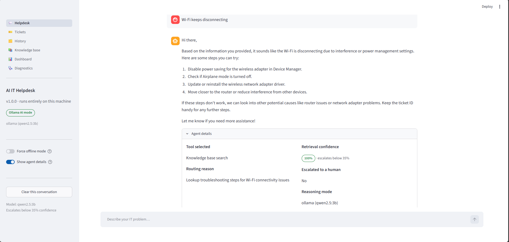
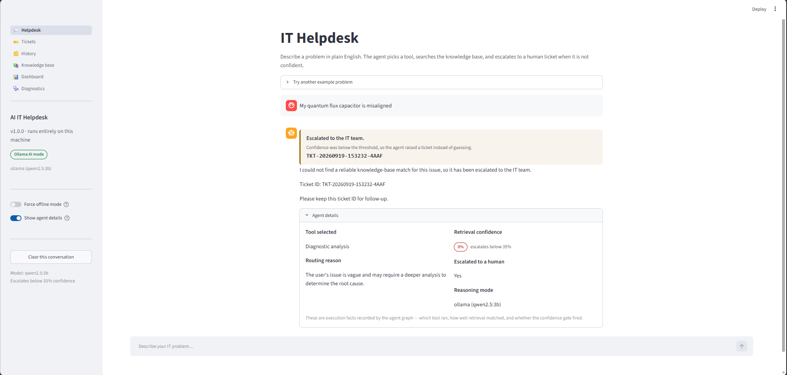
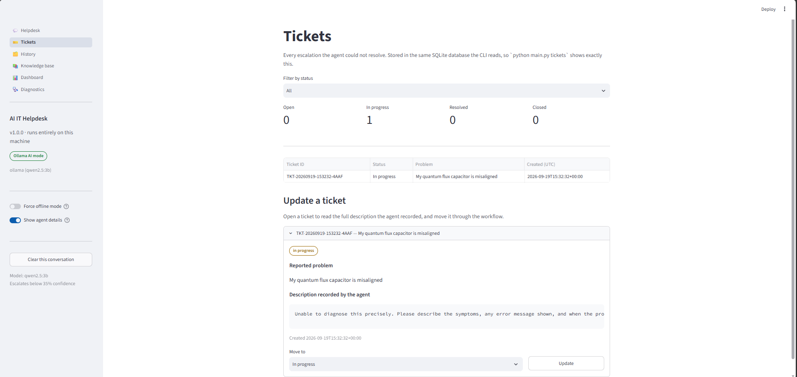
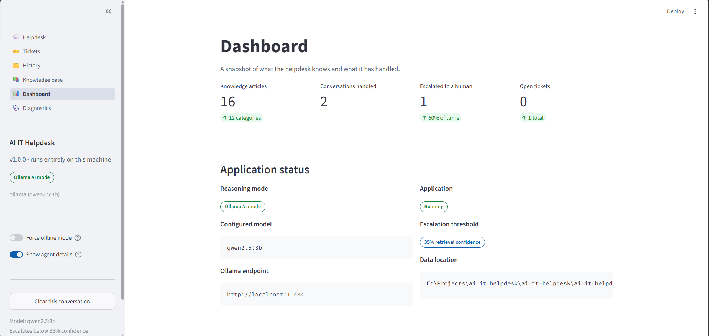
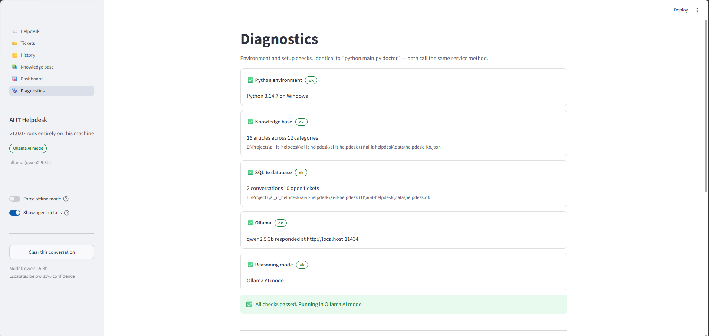
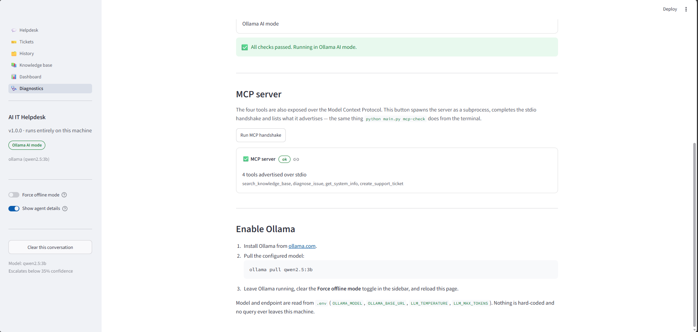

# AI IT Helpdesk Agent

> A local-first agentic IT helpdesk that routes technical issues, retrieves troubleshooting guidance, escalates low-confidence cases, and persists support tickets using LangGraph, Ollama, MCP, Streamlit, and SQLite.

[](https://github.com/Akashv-deve/AI_IT_helpdesk/actions/workflows/ci.yml)
[](https://www.python.org/)
[](https://www.langchain.com/langgraph)
[](https://ollama.com/)
[](https://modelcontextprotocol.io/)
[](tests/)
[](LICENSE)

---

## Demo

**[▶ Watch the full project demo](./demo/AI_IT_Helpdesk_Demo.mp4)**

The demo shows natural-language issue handling, tool routing, confidence-based escalation, ticket persistence, MCP verification, and offline fallback.

## Overview

AI IT Helpdesk Agent is a local support system for common technical problems such as Wi-Fi, printers, VPN, login issues, software problems, and slow computers.

The agent follows a structured workflow:

```text
User Query
    ↓
LangGraph Routing
    ↓
Tool Execution
    ↓
Retrieval Confidence Check
    ├── High confidence → Response
    └── Low confidence  → Support Ticket → Response
```

When Ollama is unavailable, a deterministic rule-based reasoner keeps the application usable without an LLM.

## Key Features

- **Agentic workflow** — LangGraph routing, tool execution, and conditional escalation.
- **Local AI** — Ollama with `qwen2.5:3b`.
- **Confidence-based escalation** — weak knowledge-base matches create a ticket instead of generating unsupported troubleshooting advice.
- **Offline fallback** — deterministic rule-based reasoning when Ollama is unavailable.
- **MCP integration** — the same four tool implementations are exposed through an MCP stdio server.
- **Persistent helpdesk** — SQLite stores conversations and support tickets.
- **Streamlit UI** — Helpdesk, Tickets, History, Knowledge Base, Dashboard, and Diagnostics.
- **Rich CLI** — interactive chat, demos, diagnostics, tickets, and history.
- **115 automated tests** — pytest and Streamlit AppTest coverage.
- **CI and linting** — GitHub Actions and Ruff.

## Core Tools

| Tool | Purpose |
|---|---|
| `search_knowledge_base` | Search the local IT knowledge base |
| `diagnose_issue` | Analyse an issue and return likely causes and steps |
| `get_system_info` | Retrieve basic local system information |
| `create_support_ticket` | Create a support ticket in SQLite |

The normal LangGraph agent uses the shared Python implementations in-process. The same tools are also exposed through MCP over stdio.

Verify the MCP interface with:

```powershell
python main.py mcp-check
```

## Screenshots

### Helpdesk



### Confidence-Based Escalation



### Ticket Management



### Dashboard



### Diagnostics




## Architecture

```text
                         ┌──────────────────┐
                         │    User Query    │
                         └────────┬─────────┘
                                  │
                                  ▼
                         ┌──────────────────┐
                         │      route       │
                         │  Select a tool   │
                         └────────┬─────────┘
                                  │
                                  ▼
                         ┌──────────────────┐
                         │     execute      │
                         │    Run tool      │
                         └────────┬─────────┘
                                  │
                                  ▼
                         ┌──────────────────┐
                         │ Confidence Check │
                         └───────┬─────┬────┘
                                 │     │
                              high     low
                                 │     │
                                 ▼     ▼
                           ┌────────┐ ┌──────────────┐
                           │ respond│ │ create ticket│
                           └────┬───┘ └──────┬───────┘
                                │            │
                                └─────┬──────┘
                                      ▼
                              ┌──────────────┐
                              │ Final Answer │
                              └──────────────┘
```

Supporting components:

```text
Ollama ───────────────► Local reasoning
RuleBasedReasoner ────► Offline fallback
JSON knowledge base ──► Retrieval
SQLite ────────────────► History + tickets
MCP server ────────────► Tool protocol
```

## Technology Stack

| Technology | Purpose |
|---|---|
| Python | Core implementation |
| LangGraph | Agent orchestration |
| Ollama + Qwen2.5 3B | Local reasoning |
| MCP | Tool protocol |
| Streamlit | Web interface |
| Rich | CLI |
| SQLite | Persistent storage |
| JSON | Knowledge base |
| pytest + AppTest | Testing |
| Ruff | Linting |
| GitHub Actions | CI |

## Installation

### Clone

```powershell
git clone https://github.com/Akashv-deve/AI_IT_helpdesk.git
cd AI_IT_helpdesk
```

### Virtual environment

```powershell
python -m venv .venv
.\.venv\Scripts\Activate.ps1
```

If PowerShell blocks activation:

```powershell
Set-ExecutionPolicy -Scope Process -ExecutionPolicy RemoteSigned
.\.venv\Scripts\Activate.ps1
```

### Dependencies

```powershell
python -m pip install --upgrade pip
pip install -r requirements.txt
```

For development and testing:

```powershell
pip install -r requirements-dev.txt
```

### Ollama

Install [Ollama](https://ollama.com/) and pull the configured model:

```powershell
ollama pull qwen2.5:3b
```

Ollama is optional. Without it, the deterministic fallback reasoner is used.

## Running

### Web application

```powershell
streamlit run app.py
```

Open `http://localhost:8501`.

### CLI

```powershell
python main.py
```

Useful commands:

```powershell
python main.py ask "my wifi keeps dropping" -v
python main.py demo
python main.py tickets --status open
python main.py history
python main.py doctor
python main.py mcp-check
```

### Offline mode

```powershell
$env:HELPDESK_OFFLINE = "1"
streamlit run app.py
```

The web UI also provides a **Force offline mode** toggle.

## Testing

The repository contains **115 automated tests** covering knowledge-base retrieval, agent routing and escalation, SQLite persistence, tool contracts, MCP behaviour, service validation, and Streamlit UI flows.

```powershell
pytest
```

Lint:

```powershell
ruff check src tests main.py app.py
```

GitHub Actions runs the test and lint workflow automatically.

## Placement Demo

A short placement demonstration can show:

1. A known IT issue and the selected tool.
2. Retrieval confidence in **Agent details**.
3. An unsupported issue triggering automatic escalation.
4. The generated support ticket and status workflow.
5. Persisted conversation history.
6. Dashboard metrics.
7. MCP handshake verification.
8. Deterministic offline fallback.

The project is designed to demonstrate practical agent engineering beyond a simple chat interface.

## Knowledge Base

The project includes **16 curated IT support articles** covering Wi-Fi, Internet connectivity, login and passwords, printers, slow computers, VPN, email, software, keyboard and mouse, browsers, and Windows issues.

Source:

```text
data/helpdesk_kb.json
```

The retrieval layer uses transparent keyword-based scoring, keeping the match mechanism easy to inspect and explain.

## Project Structure

```text
AI_IT_helpdesk/
├── app.py
├── main.py
├── data/
│   └── helpdesk_kb.json
├── screenshots/
│   ├── helpdesk.png
│   ├── escalation.png
│   ├── tickets.png
│   ├── dashboard.png
│   └── diagnostics.png
├── demo/
│   └── AI_IT_Helpdesk_Demo.mp4
├── docs/
│   ├── ARCHITECTURE.md
│   └── PROJECT_REPORT.md
├── src/
│   ├── helpdesk/
│   └── web/
├── tests/
├── .env.example
├── .github/
├── .streamlit/
├── .vscode/
├── pyproject.toml
├── requirements.txt
└── requirements-dev.txt
```

## Limitations

- Retrieval uses keyword-based scoring, so heavily paraphrased issues may produce weaker matches.
- The knowledge base currently contains 16 curated articles.
- Conversation history is persisted, but previous turns are not currently fed back into the agent as conversational context.
- The application is designed for local use and demonstration rather than multi-user production deployment.
- Retrieval confidence is a knowledge-base match score, not a calibrated probability.

## Documentation

- [Architecture](docs/ARCHITECTURE.md)
- [Project Report](docs/PROJECT_REPORT.md)

## Author

**Akash V**

Built as a portfolio project to explore practical local AI agents, tool orchestration, reliability-aware escalation, and developer-focused AI systems.

## License

MIT License — see [LICENSE](LICENSE).
